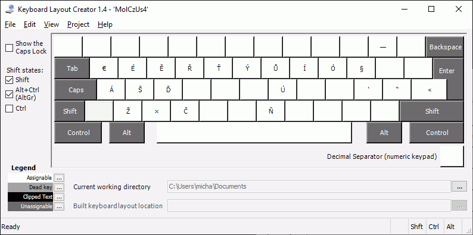
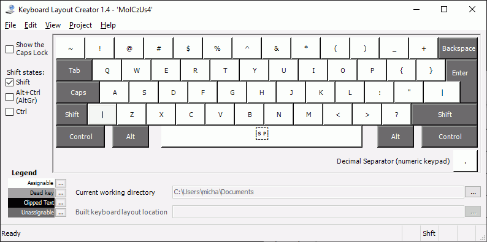

# Czech alternative keyboard layout for Windows

This is standard English US keyboard with Czech letters available
using `AltGr` (right `Alt`) or `Ctrl+Alt` combination.

Standardní anglická US klávesnice s českými znaky dostupnými pomocí
`AltGr` (pravý `Alt`) nebo kombinace `Ctrl+Alt`.

České znaky jsou na místech odpovídajících si anglických znaků, nikoli
místo čísel.

Dále klávesnice obsahuje:
* České uvozovky `„“ ‚‘ »«` \
  Výhodné např. pro Google Docs, nebo jiný editor, který neumí
  automaticky překládat anglické na dvojici českých.
* Krát `×`
* Trojtečka `…`
* Paragraf `§`
* Enková a emková pomlčka `– —`

Při psaní všemi deseti doporučuji používat levý `Ctrl+Alt` resp.
pravý `AltGr` na druhé ruce oproti psanému znaku (podobně, jako se to
doporučuje se Shiftem).

## Rozložení

`AltGr/Ctrl+Alt`

`AltGr/Ctrl+Alt Shift`

`AltGr/Ctrl+Alt CapsLock`

`AltGr/Ctrl+Alt CapsLock+Shift`

Bez přeřaďovače

`Shift`

`CapsLock`

`CapsLock+Shift`

